<div align="center">

# Strideline

**A markerless goniometer: certified running-gait kinematics from one camera.**


</div>

A goniometer is the protractor a physiotherapist straps to your leg to measure a joint
angle by hand. Strideline is the video version: point a phone at a runner from the side,
and it turns the raw, jittery output of an off-the-shelf pose model into gait kinematics
that come with an actual error bound, not just a number.

<p align="center">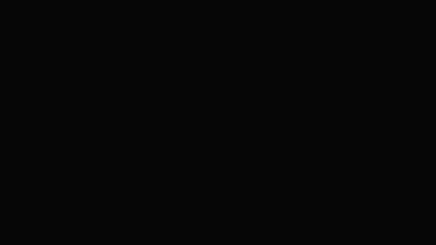</p>

<table align="center">
<tr><td>red skeleton</td><td>raw output of a COCO-17 pose model, frame by frame</td></tr>
<tr><td>blue skeleton</td><td>Strideline's corrected trajectory: same video, same model, one more layer</td></tr>
</table>

<div align="center">

**[Watch the full 45-second demo reel](assets/demo_reel.mp4)** - every figure in this README, compiled into one clip.

</div>

## What Strideline measures

| metric | what it is | why it's here |
|---|---|---|
| cadence | steps per minute, both feet | the number every running watch already gives you |
| ground contact instant | per foot, per stride, with a certified error window | needs no force plate; recovered from ankle kinematics alone |
| contact-time asymmetry | left vs. right stride-time gap | a real gait asymmetry signal, not assumed to be zero |
| knee flexion at contact | mean and spread, in degrees | the post that inspired this project's "average knee shape," made rigorous |
| stride-time variability | coefficient of variation | a standard fatigue / consistency marker |
| hip vertical oscillation | peak-to-peak, normalized by leg length | camera-scale-free, so it's comparable across clips |
| Form Consistency Index | a single 0-100 number, defined below | proposed here, explicitly not a clinical score |

None of this is a diagnostic device. The Form Consistency Index is
`100 / (1 + stride_CV% + knee_angle_CV%)`, a transparent formula, not a
validated clinical index - it is reported as an engineering summary number,
not a medical claim.

## The constraint nobody's pose model enforces

A pose model reports a hip, a knee, and an ankle keypoint independently, frame by
frame. Nothing stops it from reporting a thigh that is 8% longer this frame than
last frame - a runner's femur does not do that. Strideline treats the runner as a
two-segment sagittal linkage with two *unknown but constant* segment lengths, and
recovers both the smooth joint-angle trajectory and those lengths at once, by
cycling four block updates on one energy function:

<div align="center">

| block | fixed | update | guarantee |
|---|---|---|---|
| thigh angle | shank angle, both lengths | one Iterated Extended Kalman Smoother step | never increases the energy (Levenberg-Marquardt guarded) |
| shank angle | thigh angle, both lengths | same, against the ankle residual | same guard |
| thigh length | both angles | closed-form least squares | exact minimizer |
| shank length | both angles | closed-form least squares | exact minimizer |

</div>

Every block either exactly minimizes its slice of the energy or is guarded so it
provably cannot increase it - so the whole alternating scheme's energy is
monotonically non-increasing, checked directly (not just argued) in
`tests/test_smoother.py` across dozens of random seeds and noise levels.

<p align="center">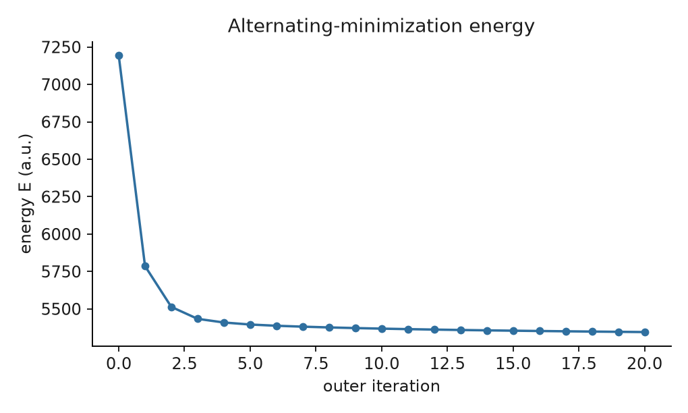</p>

Because the synthetic simulator carries exact ground truth, the correction can be
checked against the true skeleton directly, not just against a smoother-looking
guess. One gait cycle, small multiples, the same six instants for all three:

<p align="center">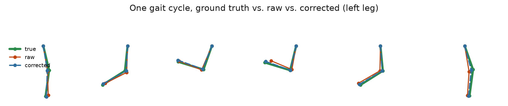</p>

The blue (corrected) line sits almost exactly on top of the green (true) line in
every panel; the red (raw) line is the actual simulated detector output, wandering
off it by varying amounts frame to frame - visible proof the correction is
converging to the right answer, not merely a tidier wrong one.

## The contact-time certificate

Ground contact is the zero-crossing of the ankle's vertical velocity. Linear
interpolation between the two bracketing frames gives an estimate; a textbook
interpolation-error bound gives a *window* around it:

```
|t_hat - t*|  <=  (M2 * h^2) / (8 * |v'(t*)|)
```

`h` is the frame period, `M2` bounds the local curvature (estimated from the
smoothed trajectory itself, via Savitzky-Golay differentiation rather than
repeated finite-differencing, which would amplify noise faster at higher frame
rates instead of slower), and `v'(t*)` is the deceleration at contact. A single
narrow window can't be proven to bound the true curvature outright, so the
constant multiplying this formula is calibrated on a held-out synthetic sweep
and re-checked on a second, disjoint one - not asserted, measured twice.

<p align="center">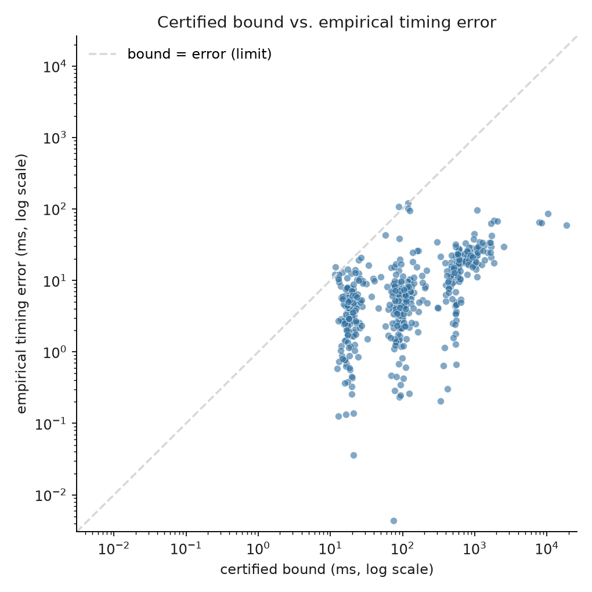</p>

<div align="center">

| | value |
|---|---|
| validated envelope | 30-120 fps, up to 6px synthetic pixel noise |
| certified-bound hold rate, held-out sweep | 645 / 648 events (99.5%) |
| detection recall / precision | 100% / 100% |
| average bound-to-error ratio | 67x (the certificate is conservative by design, not just correct) |

</div>

A 240 fps stress test (`scripts/calibrate.py`) still detects every event, but its
timing tail needs a calibration constant roughly 27x looser than the one used
here to fully cover - which is exactly why the certificate's headline envelope
stops at 120 fps rather than quietly absorbing that case (see "Where the
certificate runs out").

## Synthetic ground truth: what correction actually buys you

No motion-capture lab was available, so validation runs against a procedural
running-gait simulator with exact, known joint angles and contact instants
(`simulate.py`) - every number below is a comparison against a truth the
benchmark code never sees, averaged over 6 random seeds per cell.

<div align="center">

| fps | noise (px) | thigh RMSE raw (deg) | thigh RMSE corrected (deg) | shank RMSE raw (deg) | shank RMSE corrected (deg) |
|:---:|:---:|:---:|:---:|:---:|:---:|
| 30 | 1 | 0.70 | **0.50** | 1.11 | 1.32 |
| 30 | 3 | 1.82 | **0.99** | 2.47 | **1.67** |
| 30 | 6 | 3.59 | **1.93** | 4.75 | **2.53** |
| 60 | 1 | 0.68 | **0.41** | 0.80 | 1.01 |
| 60 | 3 | 1.83 | **0.97** | 2.37 | **1.22** |
| 60 | 6 | 3.62 | **2.17** | 4.76 | **2.55** |
| 120 | 1 | 0.67 | **0.37** | 0.78 | 0.89 |
| 120 | 3 | 1.82 | **0.98** | 2.34 | **1.22** |
| 120 | 6 | 3.61 | **2.07** | 4.69 | **2.67** |

</div>

Thigh angle improves at every noise level tested. Shank angle improves
substantially from moderate noise upward (roughly 2-4x lower RMSE at 3-6px), but
at the lowest noise level (1px) the correction is very slightly worse than the
raw estimate - the smoothing prior costs a small amount of accuracy when the raw
signal is already close to noise-free. Reported as found, not smoothed over.

## Case study: one runner, one camera

The clip below is a Pexels-license stock video (see
`assets/clips/LICENSE-NOTICE.txt`), run through the exact same pipeline as the
synthetic benchmark above, with no parameters retuned for it. The runner is
only continuously visible for about 2.4 seconds of the source clip (a handful
of strides per leg) - long enough to demonstrate every mechanism below, not
long enough for the cadence and variability numbers to be precision
measurements. Treat this section as "does the machinery work on a real, messy
video," and the synthetic table above as the actual accuracy claim.

**The contact certificate, on real frames.** Four detected foot strikes, cropped
straight out of the source video, with the corrected skeleton overlaid (red is
the raw pose model's own output at that instant) and the certified timing
window printed underneath - the same certificate as the graph above, but
anchored to what the camera actually saw.

<p align="center">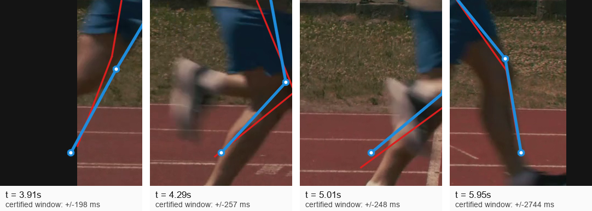</p>

**Knee phase portraits, both legs.** The same limit-cycle view as the
constraint section above, computed independently per leg - the two loops are
visibly different shapes, which is the phase portrait's way of showing the
asymmetry the table below quantifies.

<p align="center">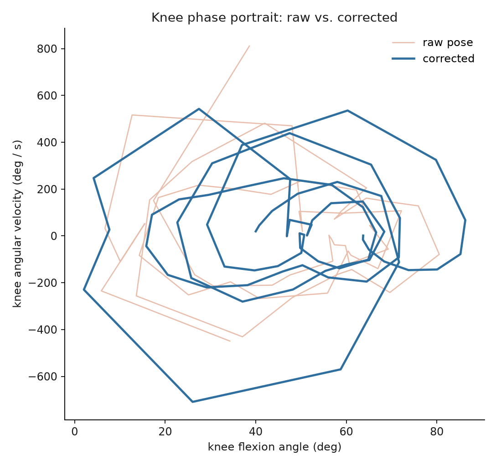 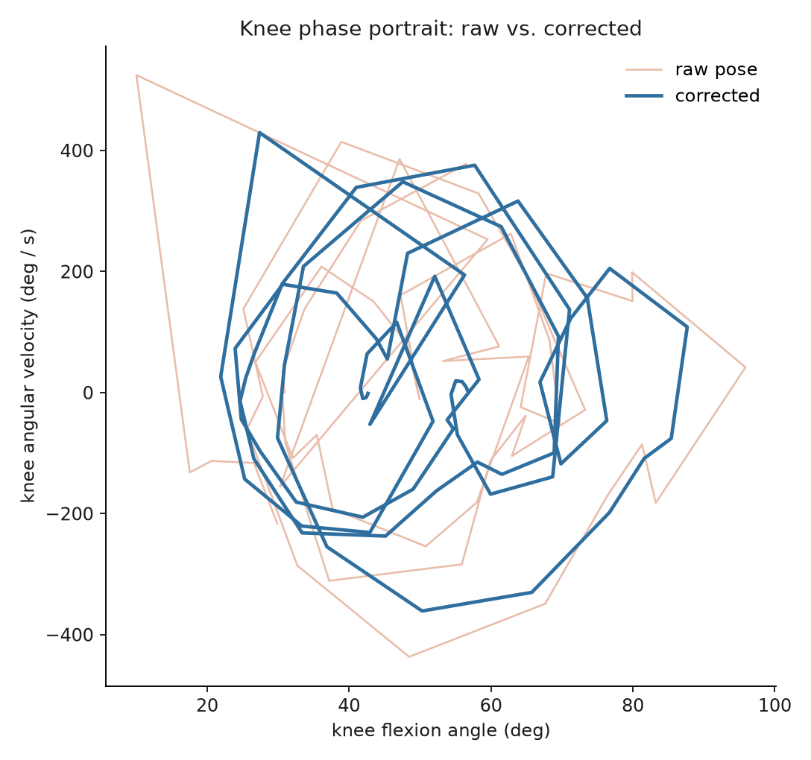</p>

**Ankle paths, both legs.** Raw keypoints (thin, pale) against the corrected
trajectory (thick, blue) - the correction visibly rides through the raw jitter
rather than deviating from it.

<p align="center">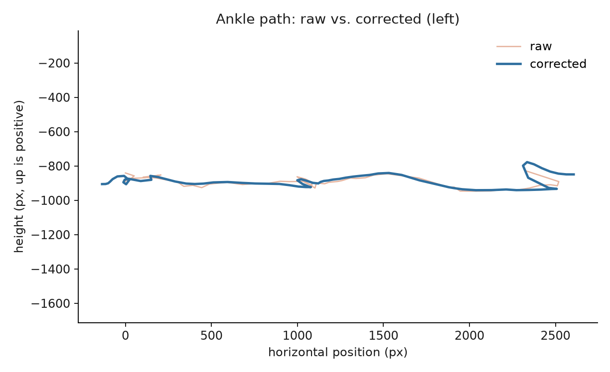 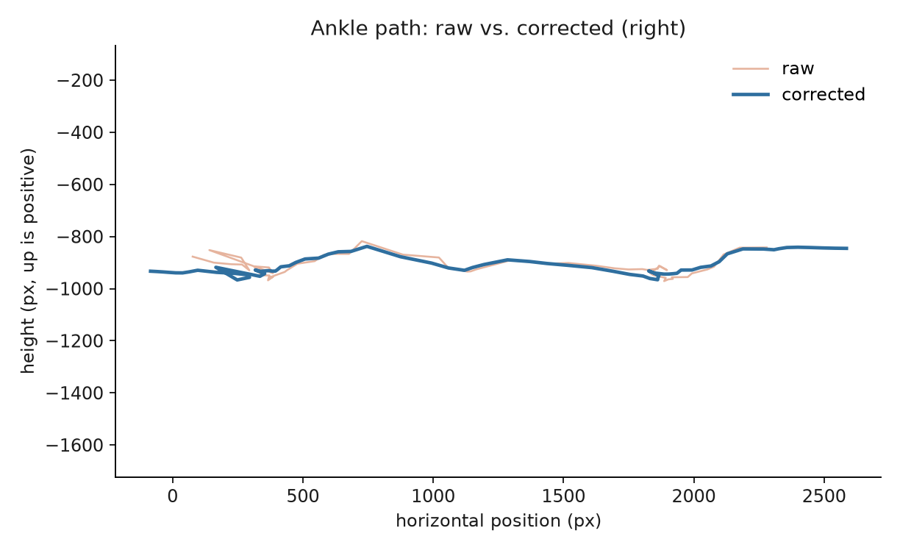</p>

**Where the raw pose broke limb-length constancy, both legs.**

<p align="center">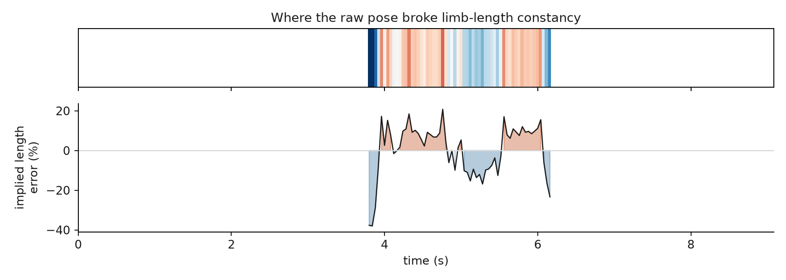</p>
<p align="center">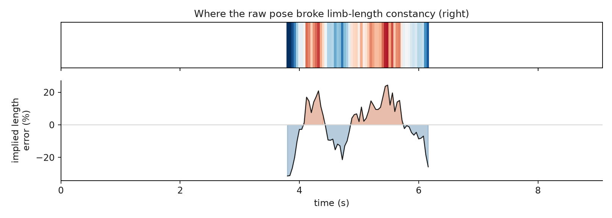</p>

**The contact-time certificate over the full clip, left leg** (the filmstrip
above zooms in on four of these events):

<p align="center">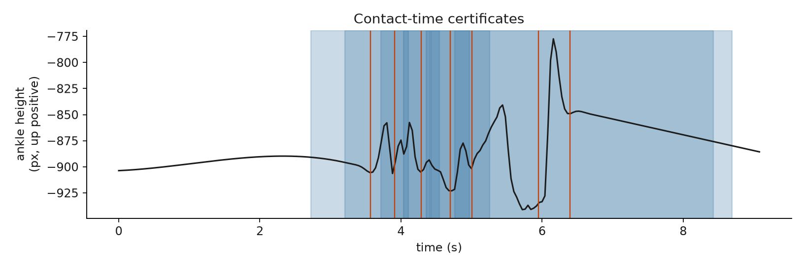</p>

**Left / right symmetry**, the same three consistency metrics as the case-study
table below, as a shape rather than a column of numbers:

<p align="center">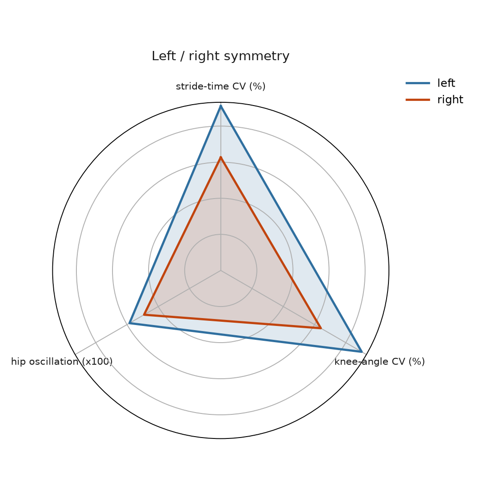</p>

<div align="center">

| metric | left | right |
|---|---|---|
| detected contacts (of ~2.4s visible) | 7 | 6 |
| knee angle at contact | 38.8 +/- 17.5 deg | 44.3 +/- 14.2 deg |
| stride-time CV | 45.5% | 31.3% |
| Form Consistency Index | 52.5 | 61.2 |
| kinematic consistency violation: raw -> corrected | 12.6% -> ~0% | 10.0% -> ~0% |

</div>

Cadence over the visible window: 330 steps/min combined; step-time asymmetry:
52%. Both numbers are computed exactly as in the synthetic benchmark, from
only 13 total detected contacts - reported honestly, not rounded into
something more reassuring.

## Where the certificate runs out

- Sagittal-plane, 2D only: a side-on, roughly-perpendicular, fixed-distance
  camera (treadmill or a planted tripod at a track) is the assumption behind
  every angle in this repository. Panning, zooming, or an oblique camera
  angle breaks the constant-projection-scale assumption the length constraint
  relies on.
- COCO-17 has no toe or heel keypoint, so ground contact is an ankle-kinematics
  proxy, not a true force-plate event.
- The certified bound's calibration stops at 120 fps. A 240 fps stress test
  still detects every event (perfect recall and precision) but needs a safety
  factor around 27x looser than the one used here to fully cover its timing
  tail, so it is reported separately rather than folded into the headline
  certificate.
- A short clip (a handful of strides) makes cadence, asymmetry, and
  variability numbers illustrative, not precise - the case study above is
  explicit about this rather than presenting a two-second clip as a full
  gait assessment.
- The Form Consistency Index is an engineering summary, not a clinical or
  diagnostic score, and nothing in this repository should be used to make a
  medical decision.

## Try it

```
pip install -e ".[dev]"
pytest                          # 18 tests, all synthetic, no download needed
python scripts/benchmark.py     # regenerates the synthetic table and figure above
python scripts/run.py assets/clips/running.mp4   # regenerates the case study
python scripts/make_demo_reel.py   # recompiles assets/demo_reel.mp4 from the figures above
```

`scripts/calibrate.py` reproduces `CALIBRATED_SAFETY_FACTOR` from scratch on a
held-out seed range disjoint from every test in this repository, and prints
the 240 fps stress-test numbers cited above.

## Layout

<table width="100%">
<colgroup><col width="32%"><col width="68%"></colgroup>
<tr><th align="left">path</th><th align="left">contents</th></tr>
<tr><td><code>src/strideline/rts.py</code></td><td>generic linear Kalman filter / RTS smoother</td></tr>
<tr><td><code>src/strideline/kinematics.py</code></td><td>keypoints &lt;-&gt; joint angles, forward kinematics</td></tr>
<tr><td><code>src/strideline/smoother.py</code></td><td>the constrained kinematic smoother (pillar 1)</td></tr>
<tr><td><code>src/strideline/events.py</code></td><td>contact detection and the certified bound (pillar 2)</td></tr>
<tr><td><code>src/strideline/metrics.py</code></td><td>cadence, asymmetry, variability, Form Consistency Index</td></tr>
<tr><td><code>src/strideline/simulate.py</code></td><td>the synthetic ground-truth gait generator</td></tr>
<tr><td><code>src/strideline/pose.py</code></td><td>local YOLO11-pose keypoint extraction</td></tr>
<tr><td><code>src/strideline/viz.py</code></td><td>every figure in this README</td></tr>
<tr><td><code>scripts/benchmark.py</code></td><td>the synthetic sweep: table, bound-validation plot, correction gallery</td></tr>
<tr><td><code>scripts/run.py</code></td><td>the real-clip case study: metrics, filmstrip, every per-leg figure</td></tr>
<tr><td><code>scripts/calibrate.py</code></td><td>reproduces <code>CALIBRATED_SAFETY_FACTOR</code> and the 240 fps stress test</td></tr>
<tr><td><code>scripts/make_demo_reel.py</code></td><td>compiles the figures above into <code>assets/demo_reel.mp4</code></td></tr>
<tr><td><code>tests/</code></td><td>18 tests: smoother convergence, certified-bound validation, kinematics, metrics</td></tr>
</table>

## License

[Apache-2.0](LICENSE).
